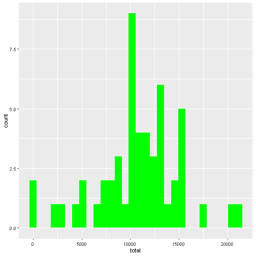
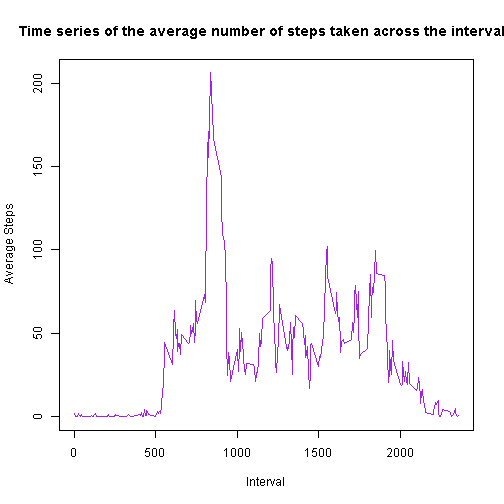
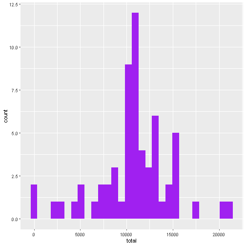
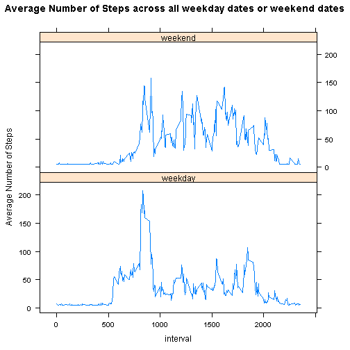

## Get the file

Unpack the file from the URL https://d396qusza40orc.cloudfront.net/repdata%2Fdata%2Factivity.zip and unpack it to your working directory


## Loading and preprocessing the data

Load the data in preparation for analysis


```r
rawData <- read.csv("activity.csv", sep = ",", stringsAsFactors = FALSE, colClasses = c("numeric", "Date", "numeric"))
```

## What is mean total number of steps taken per day?

Load the dplyr library


```r
library(dplyr)
```

### 1. Calculate the total number of steps per day.


```r
sumPerDay <- rawData %>%
group_by(date) %>%
summarise(total = sum(steps))
```

The total numbers of steps are now held in a variable called sumPerDay.

### 2. Make a histogram of the total number of steps taken each day

First load the ggplot library

```r
library(ggplot2)
```

Create the histogram


```r
ggplot(sumPerDay, aes(x=total)) + geom_histogram(fill ="green")
```

```
## Warning: Removed 8 rows containing non-finite values (stat_bin).
```



### 3. Calculate and report the mean and median of the total number of steps taken per day


```r
meanValue <- sumPerDay %>%
        summarise(meanValue = mean(total, na.rm = TRUE))
print(paste("The mean value of the total number of steps taken per day is: ", meanValue))
```

```
## [1] "The mean value of the total number of steps taken per day is:  10766.1886792453"
```

```r
medianValue <- sumPerDay %>%
        summarise(medianValue = median(total, na.rm = TRUE))
print(paste("The median value of the total number of steps taken per day is: ", medianValue))
```

```
## [1] "The median value of the total number of steps taken per day is:  10765"
```


## What is the average daily activity pattern?

### 1. Make a time series plot (i.e. type = "l") of the 5-minute interval (x-axis) and the average number of steps taken, averaged across all days (y-axis)


```r
averageNumber <- rawData %>%
group_by(interval) %>%
summarise(averageNumberSteps = mean(steps, na.rm = TRUE))
plot(x=averageNumber$interval, y=averageNumber$averageNumberSteps, type="l", xlab = "Interval", ylab = "Average Steps", main = "Time series of the average number of steps taken across the intervals", col="purple")
```



### 2. Which 5-minute interval, on average across all the days in the dataset, contains the maximum number of steps?


```r
print(paste("The 5 minute interval with maximum number of steps is interval number : ", averageNumber[averageNumber$averageNumberSteps == max(averageNumber$averageNumberSteps),]$interval))
```

```
## [1] "The 5 minute interval with maximum number of steps is interval number :  835"
```
## Imputing missing values

### 1. Calculate and report the total number of missing values in the dataset (i.e. the total number of rows with NA)


```r
print(paste("The total number of rows with missing values in the dataset is:",
            count((rawData[is.na(rawData$steps),]))))
```

```
## [1] "The total number of rows with missing values in the dataset is: 2304"
```

### 2. Devise a strategy for filling in all of the missing values in the dataset. The strategy does not need to be sophisticated. For example, you could use the mean/median for that day, or the mean for that 5-minute interval, etc.

There are some days where the entire day's data consists of NAs, so it would not be a good strategy to use the mean/median for the day.  The strategy selected is to take the mean number of steps per interval across the entire dataset and use that to populate each of the intervals in the dataset which currently are NA values.

Calulate the mean number of steps per interval:

```r
#get the interval count per day and save to intervalCount variable
intervalCount <- nrow(count(group_by(rawData, interval)))
#get complete sumPer Day records where there are no NAs
completeSumPerDay <- sumPerDay[complete.cases(sumPerDay), ]
#calculate the meanSteps per interval.  Sum of all the totals, divided by count of number of days
#in the complete data set (count(completeSumPerDay)), then divided by intervalCount to get meanSteps Per #Interval
meanStepsPerInterval <- ((sum(completeSumPerDay$total)/count(completeSumPerDay))/intervalCount)
print(paste("The average steps per interval is : ", meanStepsPerInterval))
```

```
## [1] "The average steps per interval is :  37.3825995807128"
```

### 3. Create a new dataset that is equal to the original dataset but with the missing data filled in.


```r
#copy the rawData to a new dataset
imputedDataSet <- rawData
#replace all NA values with meanStepsPerInterval
imputedDataSet[is.na(imputedDataSet)] <- as.numeric(meanStepsPerInterval)
```

### 4. Make a histogram of the total number of steps taken each day and Calculate and report the mean and median total number of steps taken per day. Do these values differ from the estimates from the first part of the assignment? What is the impact of imputing missing data on the estimates of the total daily number of steps?


```r
imputedSumPerDay <- imputedDataSet %>%
group_by(date) %>%
summarise(total = sum(steps))
#make the histogram
ggplot(imputedSumPerDay, aes(x=total)) + geom_histogram(fill ="purple")
```


 

```r
imputedMeanValue <- imputedSumPerDay %>%
        summarise(imputedMeanValue = mean(total))
print(paste("The mean value of the total number of steps taken per day is: ", imputedMeanValue))
```

```
## [1] "The mean value of the total number of steps taken per day is:  10766.1886792453"
```

```r
imputedMedianValue <- imputedSumPerDay %>%
        summarise(imputedMedianValue = median(total))
print(paste("The median value of the total number of steps taken per day is: ", imputedMedianValue))
```

```
## [1] "The median value of the total number of steps taken per day is:  10766.1886792453"
```

The mean and the median have moved closer together after added imputed missing data. Overall, the mean and median have not changed much compared to the original analysis.  This makes sense because of the choice which was made to use the mean number of steps per interval as the value to replace the NA values. The histogram shape is similar to the original histogram, however the counts have increased,the y axis now reaches 12.5 whereas the original was not even reaching 10.

## Are there differences in activity patterns between weekdays and weekends?

### 1. Create a new factor variable in the dataset with two levels – “weekday” and “weekend” indicating whether a given date is a weekday or weekend day.

Load the lubridate library and the lattice library


```r
library(lubridate)
library(lattice)
```

Add the new column and use lubridate functions to work out if weekday or weekend


```r
#Add DayType column and set to empty string
imputedDataSet %>%
        mutate(dayType = "" )

#set dayType to weekend if wday returns 6 or 7, otherwise set to weekday
imputedDataSet <- mutate(imputedDataSet, dayType = ifelse((wday(date, label = TRUE)=="Sun" | wday(date, label = TRUE)=="Sat"), "weekend", "weekday"))

# make weekday into a factor
imputedDataSet$dayType <- factor(imputedDataSet$dayType)
```
### 2. Make a panel plot containing a time series plot (i.e. \color{red}{\verb|type = "l"|}type="l") of the 5-minute interval (x-axis) and the average number of steps taken, averaged across all weekday days or weekend days (y-axis). 

First calculate the average number of steps by dayType and interval:


```r
averageNumberDayType <- imputedDataSet %>%
group_by(dayType, interval) %>%
summarise(averageNumberSteps = mean(steps))
```

Draw the plot, using lattice style xyplot


```r
#draw the lattice plot
xyplot(averageNumberSteps ~ interval | dayType, data = averageNumberDayType, type = "l", layout = c(1, 2), ylab = "Average Number of Steps", main ="Average Number of Steps across all weekday dates or weekend dates")
```



It seems that the pattern is different on weekends as the subject is more physically active during more intervals.
